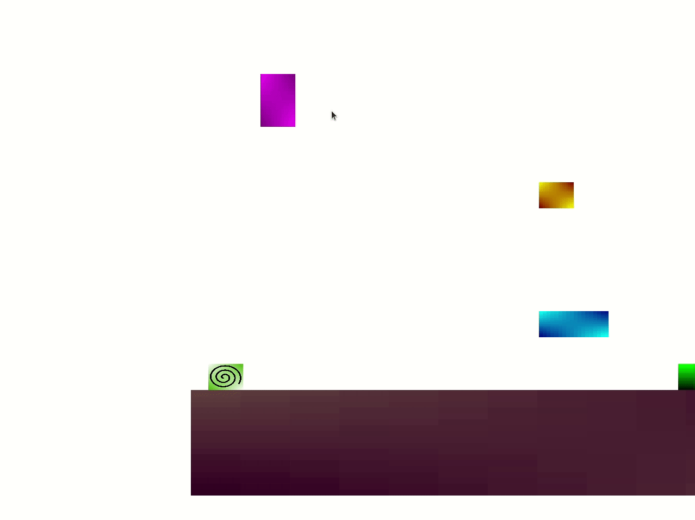
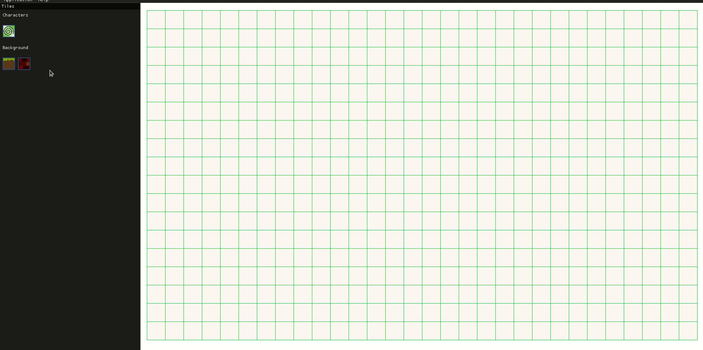

 [](https://ci.appveyor.com/project/zpervan/blockjump/branch/main)

## BlockJump ##

A simple jump-and-run platformer game. Also includes a map editor for creating custom maps.

Current state of the game:


Current state of the map editor:


### Development setup ###

Used libraries:
- [Google Test](https://github.com/google/googletest)
- [ImGui-SFML](https://github.com/eliasdaler/imgui-sfml)
- [ImGui](https://github.com/ocornut/imgui)
- [SFML](https://www.sfml-dev.org/)
- [spdlog](https://github.com/gabime/spdlog)

#### Ubuntu ####

1. Install [Bazel](https://www.bazel.build/). Installation instructions can be found 
[here](https://bazel.build/install/ubuntu).
2. Open your terminal and install the following dependencies
```shell
$ sudo apt install bazel libgl-dev freeglut3-dev
```

#### Windows (Unstable) ####

1. Install [Bazel](https://www.bazel.build/). Installation instructions can be found
      [here](https://bazel.build/install/windowsl).
2. Install Microsoft Visual Studio 19 - Community edition environment. Not sure about other MSVC version.

NOTE: Only the game can be run, the map editor still needs some special attention to get it work.

### Run ###

To run the game, use the following command for Ubuntu:
```shell
$ bazel run //:main --config=linux # or --config=linux_debug for debug mode
```
And on Windows:
```shell
> bazel run //:main --config=windows
```

